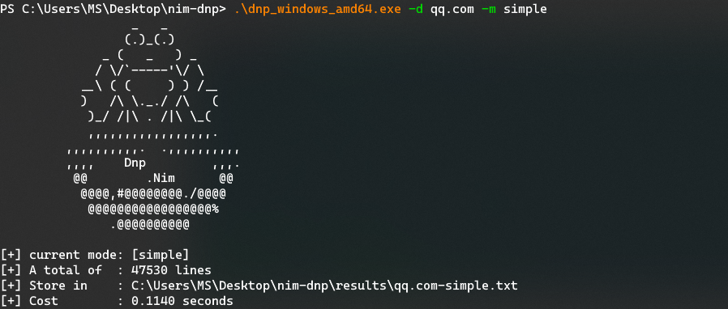

# nim-dnp — domain name predictor
[](https://www.python.org/)


> 📌 原项目链接：https://github.com/LandGrey/domainNamePredictor
> 
> 一个简单的现代化公司域名使用规律预测及生成工具
>
> A simple modernized enterprise domain name predictor and generator


作为学习，本项目采用 [Nim](https://nim-lang.org/) 语言重写了 domainNamePredictor：

- Nim 是一种静态类型的、编译型、系统编程语言。它结合了其他成熟语言的成功概念（如 Python、Ada、Modula）。Nim 生成原生且无依赖的可执行文件，不依赖于虚拟机，所以它们小巧，且易于分发。
- 部分实现存在差异，添加了 `--silent` 模式，可直接通过管道与 ksubdomain、httpx 等工具联动。
- 可在右侧 Releases 页面下载编译好的版本，文件大小约 237k +，单文件，体积小，便于携带。


## Snapshot




## Download & Compile

```bash
git clone https://www.github.com/inspiringz/nim-dnp.git
cd nim-dnp/
nimble install argparse
nimble install itertools
nim c -d:release dnp.nim
```


## Usage

```bash
Usage:
   [options]

  -h, --help
  -d, --domain=DOMAIN        single domain name (default: )
  -f, --file=FILE            domain names file path (default: )
  -m, --mode=MODE            choose predictor mode: [default, simple] Possible values: [default, simple] (default: default)
  -o, --output=OUTPUT        result output path (default: )
  -s, --silent               eg: dnp -d qq.com -s | ksubdomain -verify -silent | httpx -title -content-length -status-code
```

```bash
./dnp -h
./dnp -d qq.com
./dnp -f qq.com-domains.txt -m simple
./dnp -d demo.qq.com -m simple -o /tmp/predictor-qq.com.txt
```

& [ksubdomain](https://github.com/knownsec/ksubdomain/) & httpx：

```bash
./dnp -d qq.com -s | ksubdomain -verify -silent | httpx -title -content-length -status-code
```


## Q&A

- 什么叫 "**现代化**" 公司？

  我个人主观判断上的不成熟定义，就是公司整体 IT 基础设施和架构设计完善，会使用微服务、协同开发、自动化测试、自动化打包发布、自动化部署、自动化日志收集和自动化运维监控等多项 "现代化" 的技术解决高并发等较大体量业务问题的公司；

  这些公司或组织团体一般有较多业务，以互联网领域、近些年新成立的公司居多，域名命名及分配使用比较规范。

  

- 什么是**域名预测**？

  简答来讲就是基于 "现代化" 公司比较规范的域名使用规律已经使用的新技术架构，在已知某个域名后，预测该域名可能有哪些变体形式的域名。

  举一个简单的例子：

  已知 A 公司有一个域名 `shoot.A.com`，那么对应的接口服务域名可能是  `api.shoot.A.com`、 `shoot.restful-api.A.com`、 `shoot-api.A.com` 等；

  测试、预发等不同环境的域名可能是 

   `shoot-api.test.A.com` 、 `test.api.shoot.A.com` 、 `pre.shoot-api.A.com` 等；

  对应的不同环境的管理监控域名可能是  `shoot-monitor.dev.A.com` 、`shoot-dev-monitor.A.com` 、`st1.shoot-dashboard.A.com`  等；

  对应不同负载代理的域名可能是  `shoot-api.corp.A.com` 、 `api.shoot.internal.A.com` 等；

  对应的后端 api 服务生产环境的域名可能是 `backend-api.prod.shoot.A.com`、   `backend-api-prod.shoot.A.com`等。

  当然，在缺少域名前缀，仅知道域名为 `A.com` 时，也可以按照此规律直接进行预测。

  

- 为什么要写这个工具？

  随着对许多 "现代化" 业务的接触和实际渗透测试，我发现在域名的探测这个很小的领域中，现有的子域名爆破、第三方服务接口查询都不能很好的覆盖到 **域名预测** 这个概念。

  这样当你得到 `shoot.A.com` 域名后，很可能会遗漏上面举例中的相关重要域名，导致 "**灯下黑**"。


- 这个工具可以干什么？

  按照配置文件和生成规则来完成上述的**域名预测**，生成完整的域名字典。

  目前一个域名在  `simple`  规则下大概生成 **6w—7w** 左右个域名，在  `default`  规则下生成 **26w—29w** 个域名。

  生成完域名后可以用支持完整域名验证的工具去验证域名是否存在，比如使用 [ksubdomain](https://github.com/knownsec/ksubdomain) 命令 `subdomain -f predictor-domains.txt -verify` 。


